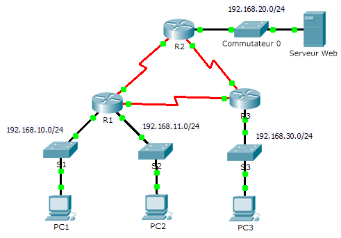
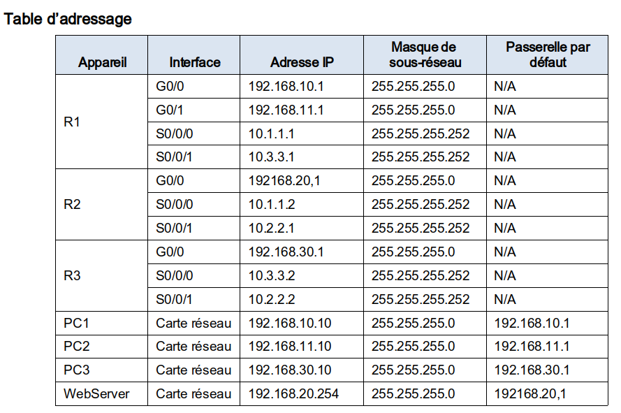
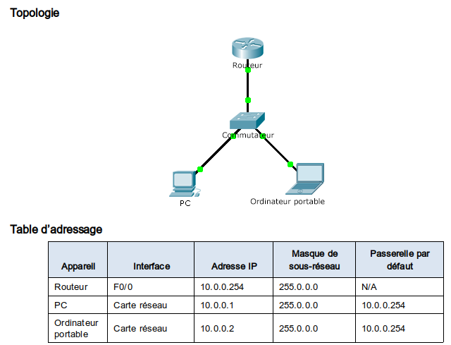

# Les ACL sur routeurs 

> Les ACL (Access Control List) servent à définir l'autorisation ou le rejet de paquets en fonction de leur adresse source.

## Creer une ACL

#### Mode: `enable` => `conf t`

| Commande                                        | Effets |
| :---------------------------------------------- | :----: |
| access-list `numéro` (`permit`|`deny`)  (`any`) |        |

## Appliquer une ACL:

#### Mode: `enable` => `conf t` => une interface (`interface <non_interface>`) 

| Commande                                  | Effet |
| ----------------------------------------- | ----- |
| ip access-group `numero_acl` (`out`|`in`) |       |

### Exemple: 

**Topologie suivante:**

| Commande                                  | Effet                                                        |
| ----------------------------------------- | ------------------------------------------------------------ |
| access-list 1 deny 192.168.10.0 0.0.0.255 | instruction refusant l’accès au réseau 192.168.30.0/24 à partir du réseau 192.168.10.0/24. |
| access-list 1 permit any                  | Autorise tout autre trafic sur l'ACL 1 (c'est l'inverse pas défaut) |
| ip access-group 1 out                     | Applique l'ACL 1 sur l'interface choisie (GigabithEthernet 0/0), en traffic sortant de l'interface (Routeur **R3**) |

## ACL sur VTY 

### Creer l'ACL

#### Mode: `enable` => `config t` 

| Commande                                  | Effet |
| ----------------------------------------- | ----- |
| access-list `numéro` (`permit`) host `ip` |       |

#### Mode: `enable` => `line vty 0 15`

| Commande                            | Effet |
| ----------------------------------- | ----- |
| access-class `numero` (`in ` `out`) |       |

#### Exemple: accès du Telnet sur un routeur

| Mode           | Effet                                                      | Commande                            |
| -------------- | ---------------------------------------------------------- | ----------------------------------- |
| (config)#      | creer l'ACL numéro 99 autorisant l'accès a l'hote 10.0.0.1 | access-list 99 permit host 10.0.0.1 |
| (config line)# | Mise en place de l'ACL sur le `VTY 0 15`                   | access-class 99 in                  |

### afficher les ACL sur un routeur

| Commande                      | effet                                                        |
| ----------------------------- | ------------------------------------------------------------ |
| show access-list              | montre la configuration des listes ACL                       |
| show run                      | montre la running config avec les ACL et les interfaces qui ont ou non des ACL |
| show ip interface `interface` | montre l'interface `interface` (donc on peut voir si ACL il y a) |

